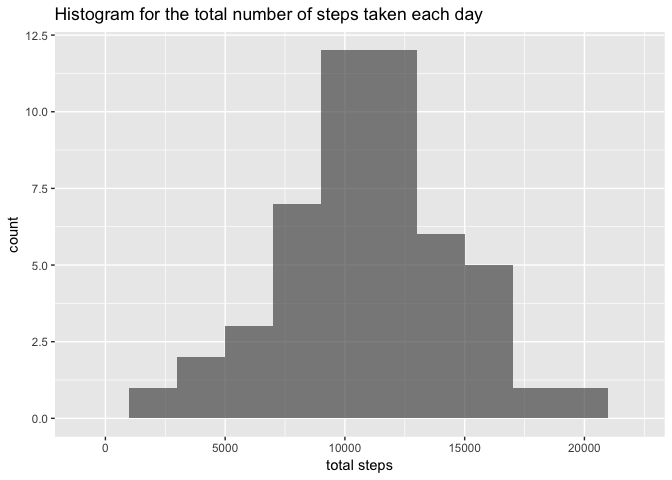

# Reproducible Research: Peer Assessment 1

```r
options(scipen=1, digits=2)
library(dplyr)
library(ggplot2)
library(lattice)
```


## Loading and preprocessing the data
1. Load the data

```r
activity <- read.csv("activity.csv")
```

2. Process/transform the data. In the dataset, columns `step` and `interval` are both integers, we'd like to convert column `date` from factor to date. 

```r
activity$date <- as.Date(activity$date)
```

## Histogram of the total number of steps taken each day
1. Calculate the total number of steps taken per day

```r
totsteps <- activity %>%
  group_by(date) %>%
  summarise(totalsteps = sum(steps, na.rm = TRUE))
```

2. Histogram of the total number of steps taken each day

```r
## remove the missing data
missingdates <- totsteps$date[totsteps$totalsteps==0]
totsteps <- totsteps[! totsteps$date %in% missingdates, ]
## set up the range
rng <- range(totsteps$totalsteps) + c(-1,1)*1e3

ggplot(data = totsteps, aes(totalsteps)) + 
  geom_histogram( binwidth = 2000, alpha = .7) +
  xlab("total steps") + 
  xlim(rng) +
  ggtitle("Histogram for the total number of steps taken each day" )
```

<!-- -->

3. Calculate and report the mean and median total number of steps taken per day?

```r
meanmedsteps <- activity %>% 
  filter(! date %in% missingdates) %>%
  group_by(date) %>%
  summarise( meansteps = mean(steps, na.rm = TRUE), 
             mediansteps = median(steps, na.rm = TRUE)) %>%
  print(n = 53)
```

```
## # A tibble: 53 x 3
##          date meansteps mediansteps
##        <date>     <dbl>       <dbl>
##  1 2012-10-02      0.44           0
##  2 2012-10-03     39.42           0
##  3 2012-10-04     42.07           0
##  4 2012-10-05     46.16           0
##  5 2012-10-06     53.54           0
##  6 2012-10-07     38.25           0
##  7 2012-10-09     44.48           0
##  8 2012-10-10     34.38           0
##  9 2012-10-11     35.78           0
## 10 2012-10-12     60.35           0
## 11 2012-10-13     43.15           0
## 12 2012-10-14     52.42           0
## 13 2012-10-15     35.20           0
## 14 2012-10-16     52.38           0
## 15 2012-10-17     46.71           0
## 16 2012-10-18     34.92           0
## 17 2012-10-19     41.07           0
## 18 2012-10-20     36.09           0
## 19 2012-10-21     30.63           0
## 20 2012-10-22     46.74           0
## 21 2012-10-23     30.97           0
## 22 2012-10-24     29.01           0
## 23 2012-10-25      8.65           0
## 24 2012-10-26     23.53           0
## 25 2012-10-27     35.14           0
## 26 2012-10-28     39.78           0
## 27 2012-10-29     17.42           0
## 28 2012-10-30     34.09           0
## 29 2012-10-31     53.52           0
## 30 2012-11-02     36.81           0
## 31 2012-11-03     36.70           0
## 32 2012-11-05     36.25           0
## 33 2012-11-06     28.94           0
## 34 2012-11-07     44.73           0
## 35 2012-11-08     11.18           0
## 36 2012-11-11     43.78           0
## 37 2012-11-12     37.38           0
## 38 2012-11-13     25.47           0
## 39 2012-11-15      0.14           0
## 40 2012-11-16     18.89           0
## 41 2012-11-17     49.79           0
## 42 2012-11-18     52.47           0
## 43 2012-11-19     30.70           0
## 44 2012-11-20     15.53           0
## 45 2012-11-21     44.40           0
## 46 2012-11-22     70.93           0
## 47 2012-11-23     73.59           0
## 48 2012-11-24     50.27           0
## 49 2012-11-25     41.09           0
## 50 2012-11-26     38.76           0
## 51 2012-11-27     47.38           0
## 52 2012-11-28     35.36           0
## 53 2012-11-29     24.47           0
```

## What is the average daily activity pattern?
1. Make a time series plot  of the 5-minute interval (x-axis) and the average number of steps taken, averaged across all days (y-axis)

```r
avgsteps <- activity %>%
  filter(! date %in% missingdates ) %>%
  group_by(interval) %>%
  summarise( meansteps = mean(steps))
with(avgsteps, plot(interval, meansteps, type = "l",
                    xlab = "5-minute interval", ylab = "average number of step taken",
                    main = "Average number of step taken across all days"))
```

<!-- -->

2. Which 5-minute interval, on average across all the days in the dataset, contains the maximum number of steps?

From 0 to 2355, 
The 5-minute interval 835 that,
on average, contains the maximum number of steps (206.17). 

## Imputing missing values
Note that there are a number of days/intervals where there are missing values (coded as 𝙽𝙰). The presence of missing days may introduce bias into some calculations or summaries of the data.

1. Calculate the total number of missing values in the dataset (i.e., the total number of rows with NAs). by looking at the summary of the data, only column `steps` contains missing data. We can simply count the number of NAs in this column:

```r
cat(paste0("Total number of missing values in the dataset is ", 
            sum(is.na(activity$steps)), "."))
```

```
## Total number of missing values in the dataset is 2304.
```
2. Strategy to filling in all of the missing values in the dataset. We simply use the median value across all days for the missing values of steps. 

```r
medsteps <- activity %>%
  filter(! date %in% missingdates ) %>%
  group_by(interval) %>%
  summarise( medsteps = median(steps))
```
3. Create a new dataset that is equal to the original dataset but with the missing data filled in.

```r
imputedactivity <- merge(activity, medsteps, by = "interval", 
                         all.x = T)
imputedactivity <- imputedactivity %>%
  mutate(steps = ifelse(is.na(steps), medsteps, steps)) %>%
  select( steps, date, interval ) %>%
  arrange(date, interval)
```

4. Make a histogram of the total number of steps taken each day and Calculate and report the mean and median total number of steps taken per day. Do these values differ from the estimates from the first part of the assignment? What is the impact of imputing missing data on the estimates of the total daily number of steps?

```r
imputedtotsteps <- imputedactivity %>%
  group_by(date) %>%
  summarise(totalsteps = sum(steps))
imputedrng <- range(imputedtotsteps$totalsteps) + c(-1,1)*1e3
ggplot(data = imputedtotsteps, aes(totalsteps)) + 
  geom_histogram( binwidth = 2000, alpha = .7) +
  xlab("total steps") + 
  xlim(imputedrng) +
  ggtitle("Histogram for the total number of steps taken each day (imputed)" )
```

<!-- -->

The mean total number of steps taken per day after imputation is 9503.87 (comp. 10766.19, both rounded its nearest hundredth) and median is 10395 (comp. 10765). Note that both statistics are lower than those of raw data. Imputing missing data using median introduces 0s to the dataset; as a result both mean and median have been more conservative in the imputed data. 

## Are there differences in activity patterns between weekdays and weekends?
1. Create a new factor variable in the dataset with two levels - "weekday" and "weekend" indicating whether a given date is a weekday or weekend day. 

```r
imputedactivity <- imputedactivity %>%
  mutate(weekdays = ifelse(weekdays(date) %in% c("Saturday", "Sunday"), "weekend", "weekday")) %>%
  mutate(weekdays = as.factor(weekdays))
```

2. Make a panel plot containing a time series plot of the 5-minute interval (x-axis) and the average number of steps taken, averaged across all weekday days or weekend days (y-axis). 

```r
paneldata <- imputedactivity %>%
  group_by(interval, weekdays) %>%
  summarise(avgstep = mean(steps))
xyplot(avgstep ~ interval | weekdays, data = paneldata,
       type = "l", 
       layout = c(1, 2), ylab = "Number of steps")
```

<!-- -->

